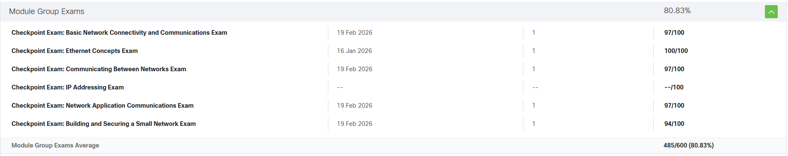

# Network Portfolio

นายศุภวัฒน์ ข่ายทอง 673380062-2 Section.2

Email : supawat.kh@kkumail.com

This repository contains my assignments, labs, projects, and certificates related to Computer Networks and Network Programming.

## 📄 Assignment

| Parameter |
| :-------- |
| `Assignment 1` | [View](<Assignments/Personal essay .pdf>) |
| `Assignment 2` | [View](<Assignments/Assignment 2 (3).pdf>) |
| `Assignment 3` | [View](<Assignments/Assignment3 (1).pkt>) |
| `Assignment 4` | [View](<Assignments/Assignment 4 (4).pdf>) |

## 🧪 Lab

| Parameter |
| :-------- |
| `Lab 1` | [View](<Labs/Lab 1 Network.pdf>) |
| `Lab 2` | [View](<Labs/Lab2.pdf>) |
| `Lab 3` | [View](<Labs/Lab3 — MIME File Transfer over Router-on-a-Stick with Wireshark Analysis.pdf>) |
| `Lab 4` | [View](<Labs/สำเนาของ LAB 4 Simulated Internet (10.10.0.0_16) & Private LANs with Stateful vs Stateless Services.pdf>) |
| `Lab 5` | [View](<>) |

## 🚀Final Project

## 🧑‍💻Netacad

